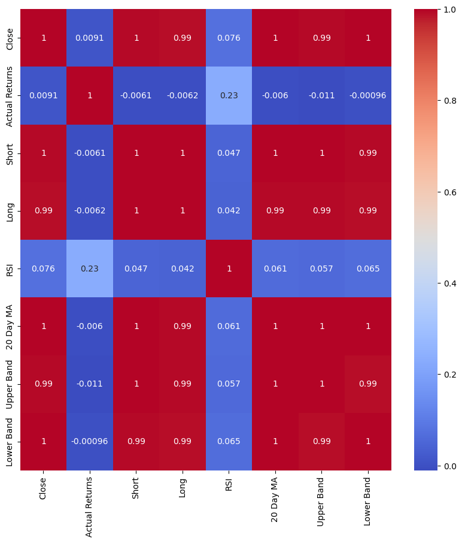
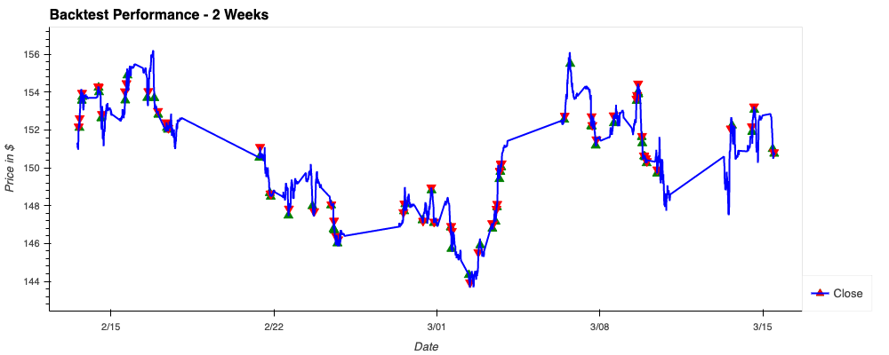
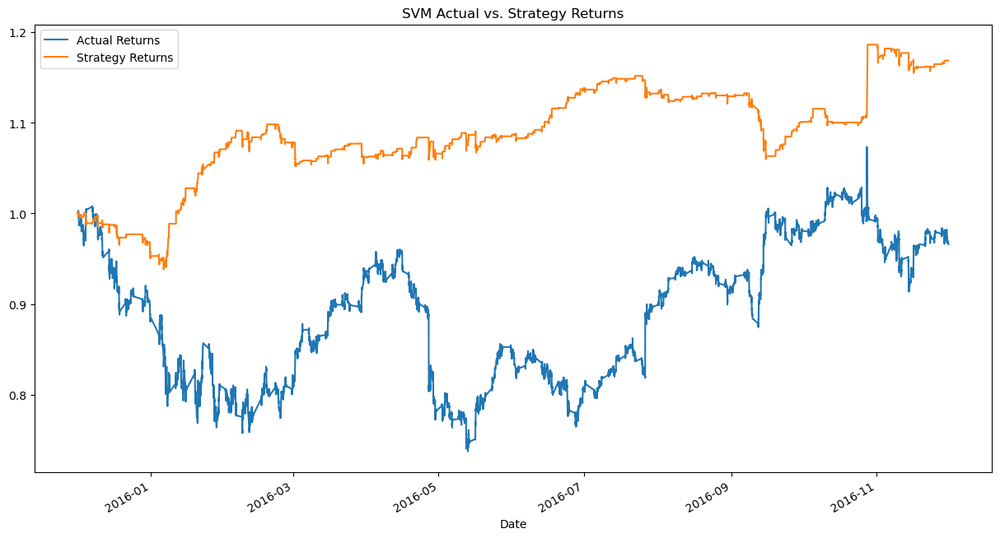
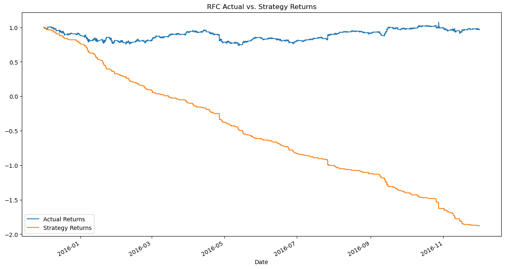
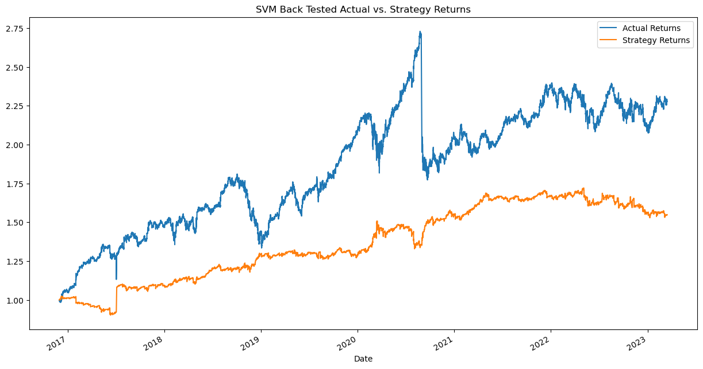
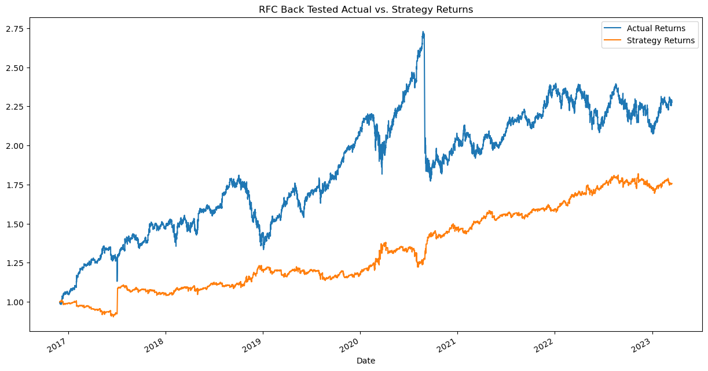

# The RSI Trading Experiment

## Project Overview

The objective of this project is to construct and evaluate machine learning models for predicting buy and sell signals. We have utilized historical stock price data and several technical indicators as features to train and test various classification models.

## Motivations for creating trading bot

Efficiency: Algorithmic trading bots can execute trades much faster than human traders can, and they can do so with minimal errors. This is because they operate on pre-defined sets of rules and conditions, and can process large amounts of data in a short amount of time.

Emotion-free trading: Humans are prone to emotions such as fear and greed, which can influence their trading decisions. Algorithmic bots, on the other hand, are completely emotion-free and can execute trades based solely on pre-defined rules and conditions. This can help eliminate some of the biases and mistakes that human traders are prone to.

24/7 trading: Algorithmic trading systems can be programmed to run 24/7, allowing for deals to be executed when the trader is sleeping or otherwise unavailable. This can take advantage of trading opportunities that may arise outside of typical trading hours.

Backtesting and optimization: Algorithmic trading systems can be backtested on prior data to see how they would have performed historically. This can aid in optimizing trading strategies and enhancing overall performance.

Diversification: Algorithmic trading bots can allow traders diversify their portfolio by allowing traders to execute trades across multiple assets and markets simultaneously. This helps in minimising risk and increasing overall returns.

## Required Libraries

The following libraries are required for this project:

- pandas
- numpy
- finta
- matplotlib
- seaborn
- hvplot.pandas
- os
- datetime
- dotenv
- alpaca_trade_api
- sklearn
- Scikit-learn

## Setting up API

Before proceeding, we need to set up the API by importing load_dotenv, setting up the Alpaca API and secret key, and creating the Alpaca API object.

## Setting API Parameters to Download Ticker Data

We start by setting up the API parameters to download the ticker data. We select the ticker, set the timeframe, and define the start and end dates. We then download the historical data from the API.

## Methodology

### The project involved the following steps

  **Data Cleaning and Preprocessing**: After extracting the necessary data, we performed data cleaning and preprocessing steps which included removing null values, changing data types. We then calculate the daily returns, short and long window EMA technical indicators, RSI indicator, and upper and lower Bollinger Bands.

  **Feature Selection**: We perform a correlation matrix and visualize it on a heatmap to determine which variables are less correlated. From the correlation map, we can see that the RSI indicator had the strongest correlation actual returns.

  
**Trading Rules**: Based on the RSI indicator, we define trading rules for buy, hold, and sell signals. We identify trade entry (1) and exit (-1) points and store them in the Entry/Exit column of the rsi_indicator DataFrame.

**Splitting the Data into Training and Testing Sets**
We split the data into training and testing sets using a time series split. We use the first 12 months of data for training and the rest of the data for testing.

**Scaling the Data**
We scale the training and testing data using a StandardScaler from Scikit-learn.

**Model Training**: Two machine learning models, SVM and RFC, were trained on the training data utilising the sklearn library. We accepted the default hyperparameters for both models.

**Model Evaluation**: We evaluated the performance of both models using classification reports and accuracy scores.

**Backtesting**: A backtest of both models was undertaken on the testing data to evaluate their performance in generating trading signals and producing profitable returns.

### Results

The results of our analysis are as follows:

- SVM Model Accuracy (Training Set): 93%
- SVM Model Accuracy (Testing Set): 93%
- RFC Model Accuracy (Training Set): 90%
- RFC Model Accuracy (Testing Set): 90%

## Conclusion

In conclusion, our analysis demonstrates that it is possible to create a successful and profitable model for predicting trading signals and generating returns using the Relative Strength Index (RSI) and machine learning algorithms. However, past observations should not be used to predict future outcomes, and the effectiveness and profitability of a model are determined by several variables, including the quality and quantity of data, feature selection, algorithm selection, and evaluation metrics. Therefore, closely assessing and tracking the efficiency of any trading strategy is crucial.
